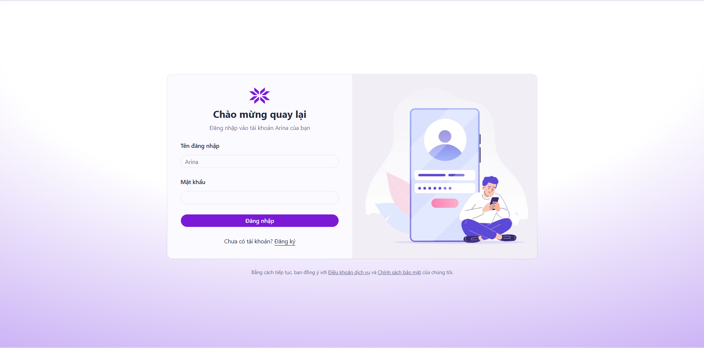
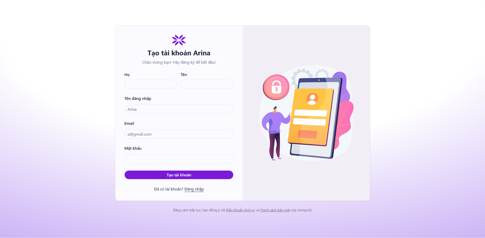
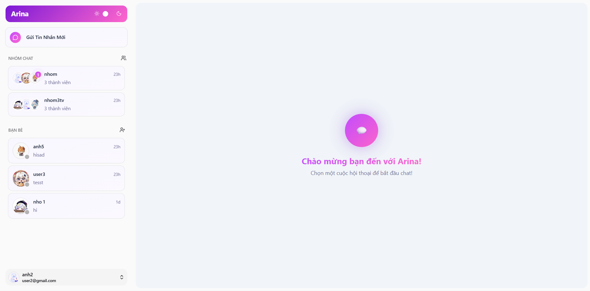
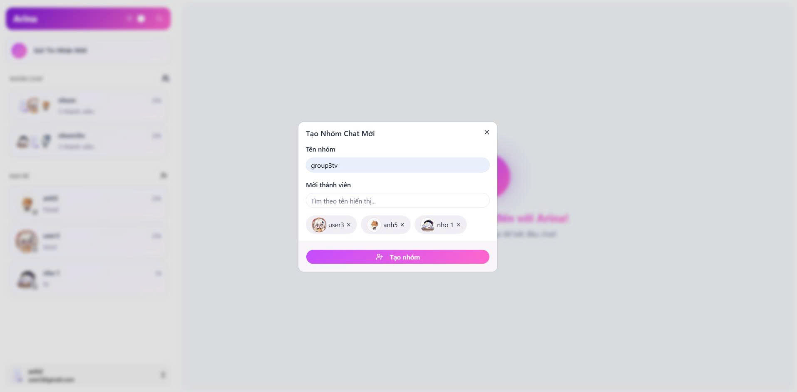
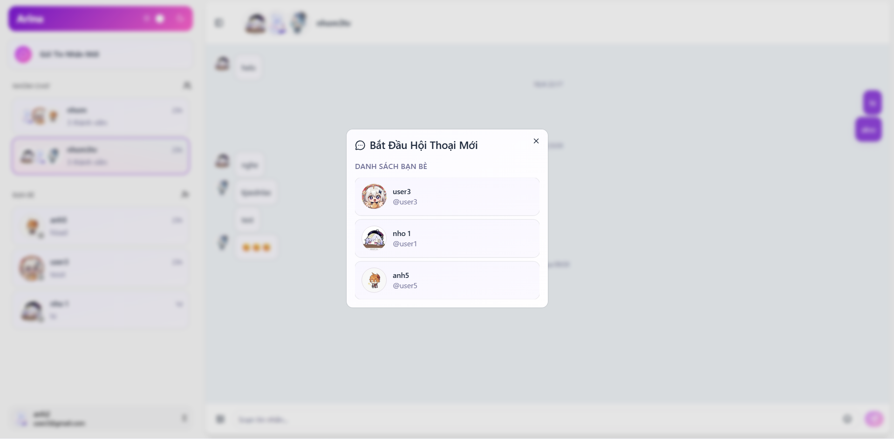
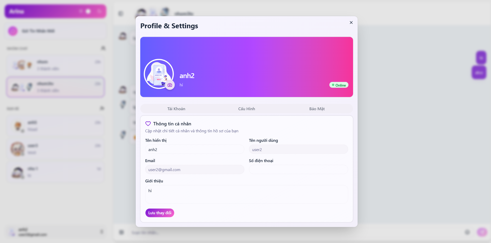

# 💬 Arina - Real-time Chat Application

Arina là một ứng dụng nhắn tin thời gian thực hoàn chỉnh (Full-stack) được thiết kế với giao diện hiện đại và trải nghiệm người dùng mượt mà. Dự án tập trung vào việc xử lý các luồng dữ liệu phức tạp từ hệ thống xác thực bảo mật đến giao tiếp tức thời thông qua WebSocket.

---

## 📸 Screenshots

   Trang Đăng Nhập   


   Trang Đăng Kí


    Giao Diện Nhắn Tin   


    Giao Diện Cuộc Trò Chuyện   


    Tạo nhóm 
   

    Bạn Bè   


    Hồ Sơ Cá Nhân



---

## 🚀 Công Nghệ Sử Dụng (Tech Stack)

###  Frontend 
*    Framework:  React (Vite) & TypeScript.
*    Quản lý State:  Zustand (Quản lý trạng thái tập trung, tránh Prop Drilling).
*    Giao diện:  Tailwind CSS & Shadcn UI (Hỗ trợ Responsive và Dark Mode).
*    Real-time:  Socket.IO Client.

###  Backend 
*    Runtime & Framework:  Node.js & Express.js.
*    Cơ sở dữ liệu:  MongoDB & Mongoose (NoSQL).
*    Tài liệu API:  Swagger (OpenAPI) giúp kiểm thử API trực tiếp trên trình duyệt.

###  Bảo mật & Dịch vụ 
*    Authentication:  JWT (Access Token & Refresh Token) lưu trữ qua HTTP-only Cookies.
*    Mã hóa:  Bcrypt băm mật khẩu với cơ chế Salt (muối).
*    Lưu trữ:  Cloudinary (Quản lý hình ảnh và avatar người dùng trên đám mây).

---

## ✨ Tính Năng Cốt Lõi

###  1. Hệ Thống Xác Thực & Bảo Mật Nâng Cao 
*   Quy trình đăng ký, đăng nhập và đăng xuất hoàn chỉnh.
*   Cơ chế  tự động làm mới Access Token  thông qua Axios Interceptor khi phiên làm việc hết hạn.
*   Bảo vệ các tuyến đường (Protected Routes) cả ở phía Client và Server.

###  2. Giao Tiếp Thời Gian Thực (Socket.IO) 
*   Gửi và nhận tin nhắn tức thì trong hội thoại cá nhân và nhóm.
*   Theo dõi trạng thái  Online/Offline  của bạn bè.
*   Thông báo trạng thái  "Đã xem" (Seen)  và cập nhật tin nhắn cuối cùng theo thời gian thực.

###  3. Quản Lý Hội Thoại & Bạn Bè 
*   Tìm kiếm người dùng theo username và gửi lời mời kết bạn.
*   Xử lý chấp nhận/từ chối lời mời kết bạn real-time.
*   Tính năng  Infinite Scroll (Cuộn vô hạn) : Tự động tải thêm lịch sử tin nhắn khi người dùng cuộn lên trên bằng kỹ thuật đảo ngược layout 180 độ.

###  4. Trải Nghiệm Người Dùng (UX/UI) 
*   Hỗ trợ đầy đủ  Dark Mode  và hiệu ứng giao diện mượt mà.
*    Skeleton Loading : Hiển thị khung giả trong quá trình tải dữ liệu giúp ứng dụng chuyên nghiệp hơn.
*   Tích hợp bộ chọn Emoji từ thư viện Emoji Mart.

---

## 📂 Cấu Trúc Dự Án

```text
Arina/
├── backend/
│   ├── source/
│   │   ├── controllers/    # Logic xử lý nghiệp vụ (Auth, Message, User...)
│   │   ├── models/         # Schema MongoDB (User, Conversation, Message...)
│   │   ├── routes/         # Định nghĩa các API endpoints
│   │   ├── middlewares/    # Middleware xác thực và upload file
│   │   ├── socket/         # Cấu hình Socket.IO và quản lý Room
│   │   └── utils/          # Hàm hỗ trợ (Helper functions)
│   └── swagger.json        # Tài liệu đặc tả API
├── frontend/
│   ├── src/
│   │   ├── components/     # UI Components (Sidebar, Chat, Skeleton...)
│   │   ├── pages/          # Các trang chính (Login, Register, ChatApp)
│   │   ├── services/       # Lớp gọi API (Axios instance)
│   │   ├── store/          # Quản lý trạng thái với Zustand
│   │   └── types/          # Định nghĩa kiểu dữ liệu TypeScript
└── .gitignore              # Quản lý các tệp không đẩy lên Git
```

---
*Dự án được thực hiện nhằm nghiên cứu và áp dụng các công nghệ Web Full-stack hiện đại.*

